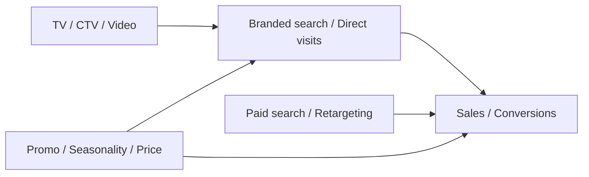

# Two-Stage Funnel MMM: Measuring Upper-Funnel Halo Effects

**Marketing Science Bootcamp -- Week 2 Offline Draft**

---

## What you'll learn

- Why upper-funnel media can look weak or inflated in a single-stage MMM.
- How a two-stage model separates demand generation from demand capture.
- How branded search, direct visits, organic traffic, or awareness metrics can act as mediators.
- How to decompose total impact into direct and indirect effects.
- Why two-stage models are useful but not automatically causal.

---

## 1. The Funnel Problem in MMM

A standard MMM often puts every media variable into one equation:

$$
Sales_t =
\beta_0 +
\beta_1 TV_t +
\beta_2 CTV_t +
\beta_3 PaidSearch_t +
\beta_4 Retargeting_t +
\beta_5 Email_t +
\epsilon_t
$$

This is easy to estimate and easy to explain, but it hides an important marketing reality:

> Some media creates demand. Other media captures demand.

Upper-funnel channels such as TV, CTV, online video, audio, OOH, display, and broad-reach social
often do not convert immediately. They increase awareness, consideration, memory, site visits, and
branded search. Lower-funnel channels such as paid search, shopping ads, retargeting, affiliates,
and email often harvest that demand once the customer is already in market.

If we put both types of media into one equation, three things can happen:

1. **Upper-funnel effects are understated** because the model credits the final click or high-intent
   channel.
2. **Lower-funnel effects are overstated** because branded demand created elsewhere is attributed
   to paid search or retargeting.
3. **Coefficients become unstable** because upper- and lower-funnel activity often move together
   during campaigns, promotions, and seasonal peaks.

The goal of a two-stage funnel MMM is to make the pathway explicit.

---

## 2. The Basic Idea

Instead of one equation that predicts sales directly from every channel, we model the funnel in
stages.

**Stage 1: Model the intermediate KPI.**

$$
BrandedSearch_t =
f(TV_t, CTV_t, YouTube_t, Display_t, OOH_t, Controls_t) + \epsilon_{1,t}
$$

**Stage 2: Model the business outcome.**

$$
Sales_t =
g(PaidSearch_t, Retargeting_t, Email_t, \widehat{BrandedSearch}_t, Controls_t)
+ \epsilon_{2,t}
$$

The intermediate KPI is often called a **mediator** because it sits on the causal path between
upper-funnel media and sales:



In this framing, TV may have two different effects:

- **Direct effect:** TV affects sales even after controlling for the mediator.
- **Indirect effect:** TV affects branded search, and branded search affects sales.

The indirect effect is what vendors often describe as a **halo effect**.

---

## 3. Why Branded Search Is the Workhorse Mediator

Branded search is commonly used because it has several practical advantages:

- It is observable at daily or weekly grain.
- It often responds quickly to broad-reach media.
- It is closer to intent than awareness survey metrics.
- It is available historically for many brands.
- Stakeholders already understand it as a signal of demand.

But branded search is not perfect. It can also respond to promotions, PR, product launches,
competitor activity, price changes, seasonality, and existing brand strength. That means branded
search is not a pure measure of upper-funnel impact. It is a useful mediator, not a magic causal
instrument.

Other possible mediators include:

| Mediator | Strength | Main risk |
|---|---|---|
| Branded search volume | Granular and intent-rich | Can be driven by promotions or baseline demand |
| Direct site visits | Often responsive to offline and video media | Can include returning customers and app behavior |
| Organic traffic | Captures unpaid demand | SEO changes can confound interpretation |
| Brand search impressions | Available from search platforms | Platform coverage and auction dynamics matter |
| Awareness or consideration survey | Closest to brand-lift concept | Sparse, noisy, and often low frequency |
| App opens or store visits | Useful for retail/app businesses | Strongly affected by CRM and product usage |

---

## 4. The Two-Stage Contribution Calculation

Suppose Stage 1 estimates:

$$
\widehat{BrandedSearch}_t =
0.30 \times TV^{*}_{t} +
0.20 \times CTV^{*}_{t} +
0.10 \times Display^{*}_{t}
$$

where each media variable has already been adstocked and saturated.

Suppose Stage 2 estimates:

$$
\widehat{Sales}_t =
0.50 \times PaidSearch^{*}_{t} +
2.00 \times \widehat{BrandedSearch}_t
$$

Then TV's indirect contribution to sales is:

$$
\text{TV} \rightarrow \text{Branded Search} \rightarrow \text{Sales}
= 0.30 \times 2.00 = 0.60
$$

In words:

> If one transformed unit of TV creates 0.30 units of branded search, and one unit of branded search
> creates 2.00 units of sales, then TV's mediated sales effect is 0.60 sales units.

With time-series MMM, we compute this over every week:

$$
IndirectContribution_{TV,t}
=
ContributionToMediator_{TV,t}
\times
EffectOfMediatorOnSales
$$

Then sum over time to get total mediated contribution.

---

## 5. A Practical OLS Version

The simplest teaching version uses two OLS regressions.

```python
import numpy as np
import pandas as pd
import statsmodels.api as sm

rng = np.random.default_rng(42)
n_weeks = 52
data = pd.DataFrame({
    "tv_adstock_sat": rng.uniform(0, 1, n_weeks),
    "ctv_adstock_sat": rng.uniform(0, 1, n_weeks),
    "youtube_adstock_sat": rng.uniform(0, 1, n_weeks),
    "display_adstock_sat": rng.uniform(0, 1, n_weeks),
    "paid_search_adstock_sat": rng.uniform(0, 1, n_weeks),
    "retargeting_adstock_sat": rng.uniform(0, 1, n_weeks),
    "email": rng.uniform(0, 1, n_weeks),
    "seasonality": np.sin(np.linspace(0, 2 * np.pi, n_weeks)),
    "promo": rng.integers(0, 2, n_weeks),
})
data["branded_search"] = (
    20
    + 0.30 * data["tv_adstock_sat"]
    + 0.20 * data["ctv_adstock_sat"]
    + 0.10 * data["display_adstock_sat"]
    + 2.0 * data["seasonality"]
    + rng.normal(0, 0.5, n_weeks)
)
data["sales"] = (
    100
    + 0.50 * data["paid_search_adstock_sat"]
    + 2.00 * data["branded_search"]
    + 4.0 * data["promo"]
    + rng.normal(0, 1.0, n_weeks)
)

# Stage 1: upper-funnel media -> branded search
X_stage1 = data[
    [
        "tv_adstock_sat",
        "ctv_adstock_sat",
        "youtube_adstock_sat",
        "display_adstock_sat",
        "seasonality",
        "promo",
    ]
]
y_stage1 = data["branded_search"]

stage1 = sm.OLS(y_stage1, sm.add_constant(X_stage1)).fit()
data["branded_search_pred"] = stage1.predict(sm.add_constant(X_stage1))

# Stage 2: lower-funnel media + predicted mediator -> sales
X_stage2 = data[
    [
        "paid_search_adstock_sat",
        "retargeting_adstock_sat",
        "email",
        "branded_search_pred",
        "seasonality",
        "promo",
    ]
]
y_stage2 = data["sales"]

stage2 = sm.OLS(y_stage2, sm.add_constant(X_stage2)).fit()
```

This is useful pedagogically because students can see the cascade clearly:

1. Upper-funnel media predicts an intermediate KPI.
2. The predicted intermediate KPI enters the sales model.
3. The upper-funnel halo is calculated by multiplying the two links.

However, this simple version has an important weakness: it treats the Stage 1 prediction as known
with certainty. In reality, Stage 1 has uncertainty, and that uncertainty should flow into Stage 2.

---

## 6. A Better Bayesian Version

In a Bayesian model, we can estimate both stages jointly:

$$
Mediator_t \sim Normal(\mu_{M,t}, \sigma_M)
$$

$$
\mu_{M,t} =
\alpha_M +
\sum_j \beta^{M}_j UpperFunnel^{*}_{j,t}
+ \sum_k \gamma^{M}_k Controls_{k,t}
$$

$$
Sales_t \sim Normal(\mu_{Y,t}, \sigma_Y)
$$

$$
\mu_{Y,t} =
\alpha_Y +
\sum_j \beta^{Y}_j LowerFunnel^{*}_{j,t}
+ \lambda M_t
+ \sum_k \gamma^{Y}_k Controls_{k,t}
$$

The key difference is that the mediator relationship and the sales relationship are estimated inside
one probabilistic system. This gives us posterior distributions for:

- the upper-funnel effect on the mediator,
- the mediator effect on sales,
- the indirect effect,
- the direct effect,
- the total effect.

This is the spirit of the PyMC-Marketing upper-funnel causal approach: define a funnel-shaped DAG,
model the mediator, model the downstream outcome, and use posterior simulations to estimate
counterfactual effects.

---

## 7. Counterfactual Thinking

The causal question is not:

> Was TV correlated with sales?

The better question is:

> What would sales have been if TV had been lower, holding the rest of the model structure fixed?

For an upper-funnel channel, the counterfactual has two steps:

1. Predict what the mediator would have been under the intervention.
2. Push that counterfactual mediator through the sales model.

For example:

$$
TV_t = observed
\Rightarrow
\widehat{BrandedSearch}^{observed}_t
\Rightarrow
\widehat{Sales}^{observed}_t
$$

$$
TV_t = 0
\Rightarrow
\widehat{BrandedSearch}^{noTV}_t
\Rightarrow
\widehat{Sales}^{noTV}_t
$$

Then:

$$
TVEffect_t =
\widehat{Sales}^{observed}_t -
\widehat{Sales}^{noTV}_t
$$

This is more aligned with causal reasoning than simply reading a coefficient from a regression
table.

---

## 8. Comparison of Approaches

| Approach | How it works | Strength | Weakness |
|---|---|---|---|
| Single-stage MMM | Put all channels in one sales equation | Simple and familiar | Can misattribute funnel effects |
| Two-stage OLS | Model mediator first, then sales | Easy to teach and explain | Understates uncertainty; generated regressor issue |
| Joint Bayesian mediator model | Estimate mediator and outcome together | Propagates uncertainty; natural counterfactuals | More complex and slower |
| Interaction model | Add terms like `TV x PaidSearch` | Captures synergy in one equation | Hard to interpret and often unstable |
| Response-curve shift | Let upper funnel shift lower-funnel saturation | Elegant for budget optimization | Harder to validate and communicate |
| SEM / formal mediation | Model direct and indirect paths explicitly | Clear causal language | Strong assumptions; needs careful identification |

---

## 9. Teaching Example: TV, Branded Search, and Paid Search

Use this example when explaining the business intuition.

Imagine a brand launches a TV campaign. In the following weeks:

1. More people remember the brand.
2. Some search for the brand name.
3. Paid search captures some of those high-intent queries.
4. Sales increase.

A naive single-stage MMM might say:

> Paid search drove the sales because paid search was closest to the purchase.

A two-stage funnel MMM says:

> Paid search captured demand, but some of that demand was created by TV. We need to credit both
> the demand creator and the demand capturer.

This is the core intuition students should leave with.

---

## 10. Causal Assumptions and Failure Modes

Two-stage models are powerful, but they require strong assumptions.

### Assumption 1: The mediator is on the causal path

If branded search is just another symptom of demand, not a mechanism caused by media, then the
model can overstate upper-funnel halo effects.

### Assumption 2: Confounders are controlled

Promotions, pricing, PR, competitor activity, seasonality, distribution changes, and product launches
can affect both branded search and sales. If omitted, they create biased mediated effects.

### Assumption 3: The time ordering is plausible

Upper-funnel media should precede the mediator, and the mediator should precede or coincide with
sales. If all variables move in the same week, lag and adstock choices become crucial.

### Assumption 4: The lower-funnel channel is not mechanically creating the mediator

Paid search impressions and clicks can be affected by branded search demand, but paid search spend
can also affect search impression volume through budget and bidding. Be clear whether the mediator
is demand-side behavior or platform-side delivery.

### Assumption 5: The model has enough independent variation

If TV, CTV, YouTube, paid search, and promotion all spike together, the model may not be able to
separate their effects without strong priors or experimental calibration.

---

## 11. Practical Modeling Checklist

Before building a two-stage funnel MMM, ask:

- What is the upper-funnel channel expected to change?
- Is the mediator measured before the outcome, or at least at a plausible lag?
- Could the mediator be driven by non-media demand shocks?
- Do we have controls for promotions, pricing, seasonality, PR, and competitor activity?
- Are we modeling paid search spend, clicks, impressions, or query demand?
- Are we comfortable treating the mediator as a causal pathway, or only as a diagnostic signal?
- Can we validate the halo with a geo test, holdout, brand-lift study, or campaign switchback?

---

## 12. Student Exercise

Use a simple synthetic dataset with four variables:

- `tv_spend`
- `paid_search_spend`
- `branded_search`
- `sales`

Fit three models:

1. **Naive model**

   $$
   Sales_t = TV_t + PaidSearch_t + Controls_t
   $$

2. **Mediator model**

   $$
   BrandedSearch_t = TV_t + Controls_t
   $$

3. **Outcome model**

   $$
   Sales_t = PaidSearch_t + \widehat{BrandedSearch}_t + Controls_t
   $$

Then answer:

- How does the estimated TV effect change between the naive and two-stage model?
- How much of TV's effect is mediated through branded search?
- What happens if you omit a promotion variable that affects both branded search and sales?
- What happens if TV and paid search always run in the same weeks?

The goal is not to get the "right" answer. The goal is to see how model structure changes
attribution.

---

## 13. Key Takeaway

A two-stage funnel MMM is a way to model marketing as a system rather than a pile of channels.

The basic idea is simple:

> Upper-funnel media creates demand. Lower-funnel media captures demand. A mediator connects the two.

The hard part is causal identification. If the mediator is well chosen, controls are credible, timing
is plausible, and uncertainty is propagated, the approach can produce a more realistic view of halo
effects. If those conditions fail, the model may simply convert correlation into a more elaborate
story.

Use two-stage models as a disciplined causal hypothesis, not as a vendor magic trick.

---

## References and Further Reading

- PyMC-Marketing, "Measuring Upper-Funnel Impact with PyMC-Marketing." The notebook demonstrates
  a DAG-based mediator model, an all-in causal MMM comparison, and simulation-based counterfactual
  effect estimation.
  <https://www.pymc-marketing.io/en/stable/notebooks/mmm/mmm_upper_funnel_causal_approach.html>
- Dinner, I. M., van Heerde, H. J., & Neslin, S. A. (2014). "Driving Online and Offline Sales:
  The Cross-Channel Effects of Traditional, Online Display, and Paid Search Advertising."
  *Journal of Marketing Research*, 51(5), 527-545. The paper studies direct and indirect effects
  through intermediate search advertising metrics.
  <https://doi.org/10.1509/jmr.11.0466>
- Chan, D., & Perry, M. (2017). "Challenges and Opportunities in Media Mix Modeling."
  Google Research. Useful background on why MMM estimates are fragile when data are limited,
  inputs are correlated, or the model does not capture the causal relationship between variables.
  <https://research.google/pubs/challenges-and-opportunities-in-media-mix-modeling/>
- Chen, A., Chan, D., Perry, M., Jin, Y., Sun, Y., Wang, Y., & Koehler, J. (2018).
  "Bias Correction For Paid Search In Media Mix Modeling." This is useful for discussing why
  paid search is especially vulnerable to demand-selection bias in MMM.
  <https://arxiv.org/abs/1807.03292>
- Sellforte, "Should You Include Branded Search Spend in Marketing Mix Modeling?" A practical
  vendor-oriented discussion of branded search inclusion and interpretation.
  <https://sellforte.com/blog/should-you-include-branded-keyword-paid-search-spend-in-marketing-mix-modeling-mmm>
