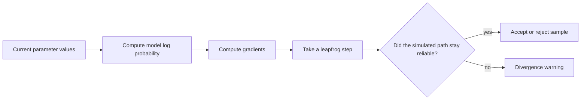
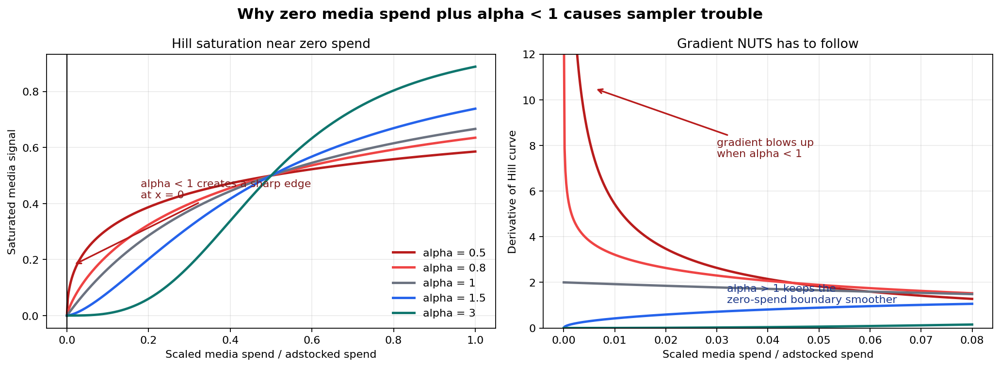
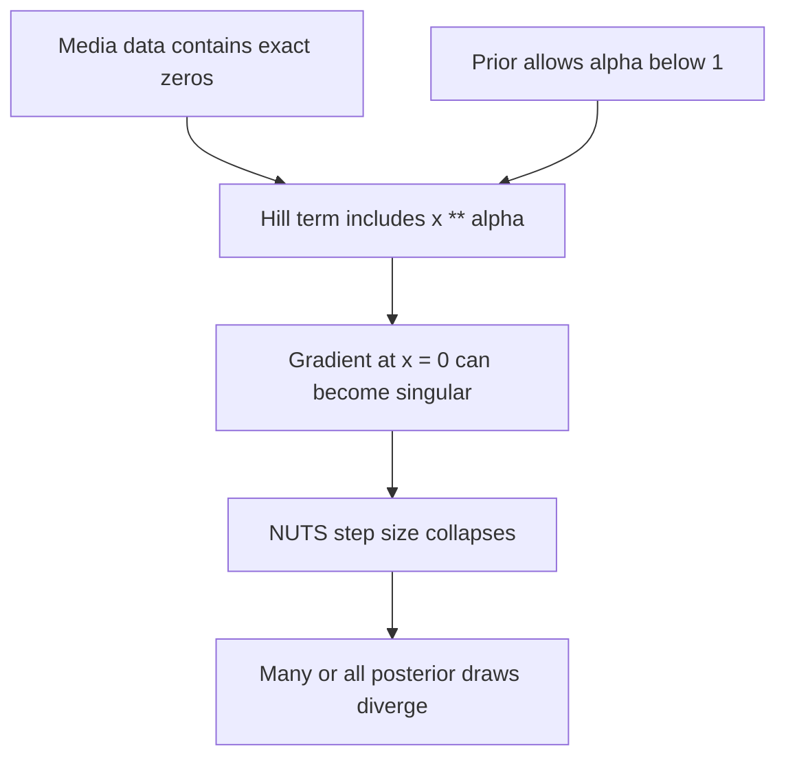

# Why the NUTS Sampler Diverged in Session 4

This note explains the divergence problem in `session_04_bayesian_mmm.ipynb` in student-friendly
terms. The short version:

> The sampler was not broken. It was warning us that our model had a difficult geometric shape caused
> by zero media spend values and a Hill saturation parameter that was allowed to go below 1.

---

## 1. What NUTS Is Trying To Do

In a Bayesian model, we want samples from the posterior:

$$
P(\text{parameters} \mid \text{data})
$$

PyMC uses a sampler called **NUTS**: the No-U-Turn Sampler. NUTS is a gradient-based MCMC sampler. That
means it does not wander randomly through parameter space. It uses the slope, or gradient, of the
posterior to move efficiently toward likely parameter values.

An imperfect but useful picture:



A **divergence** means NUTS tried to simulate a path through the posterior, but the numerical path
became unreliable. When there are many divergences, the posterior samples can be biased because the
sampler may be avoiding hard-to-reach regions.

---

## 2. Where the Problem Appeared in the MMM

The Bayesian MMM transforms each media channel in three steps:


The issue happened inside the **Hill saturation** step.

The Hill function includes this term:

$$
x^{\alpha}
$$

where:

- `x` is the scaled or adstocked media signal.
- `alpha` controls the steepness of the saturation curve.

Our media data contains real zero-spend periods. After scaling, those periods become:

```python
x = 0.0
```

That is not automatically a problem. For positive `alpha`, the value `0 ** alpha` is still 0.

The problem is the **gradient** at zero.

---

## 3. Why `alpha < 1` Is Dangerous at Zero

The derivative of `x ** alpha` is:

$$
\frac{d}{dx}x^{\alpha} = \alpha x^{\alpha - 1}
$$

Now look at what happens when `x = 0`:

| Alpha region | What happens near zero? | Sampler impact |
|---|---|---|
| `0 < alpha < 1` | The derivative can explode toward infinity. | NUTS sees a sharp edge and can diverge. |
| `alpha = 1` | The derivative is finite. | Usually more stable. |
| `alpha > 1` | The derivative approaches 0 at zero. | Much smoother geometry. |

Here is the shape problem visually:



The left panel shows the Hill curve near zero media spend. The right panel shows the gradient NUTS has
to follow. The red curves are `alpha < 1`; they create a sharp boundary at zero. Because our data has
exact zeros, the sampler repeatedly encountered that boundary.

---

## 4. Why Increasing `target_accept` Alone Was Not Enough

PyMC's warning often says:

```text
Increase target_accept or reparameterize.
```

`target_accept` controls how cautious NUTS is. Higher values usually mean smaller steps. Smaller steps
can help when there are a few divergences.

But in this case, the original model had a deeper problem:



Asking NUTS to take smaller steps does not remove the singular-gradient region. It only asks the
sampler to tiptoe around a cliff.

That is why the better first fix was to change the model parameterization.

---

## 5. The Fix

The original model let `alpha` be any positive number:

```python
import pymc as pm

n_channels = 3
with pm.Model():
    alpha = pm.Gamma("alpha", alpha=2, beta=2, shape=n_channels)
```

That prior allows values between 0 and 1. Those values caused trouble at exact zero media spend.

The fixed model uses:

```python
import pymc as pm

n_channels = 3
with pm.Model():
    alpha_offset = pm.Gamma("alpha_offset", alpha=2, beta=1, shape=n_channels)
    alpha = pm.Deterministic("alpha", 1 + alpha_offset)
```

This does three things:

1. `alpha_offset` is still learned from the data.
2. `alpha` is always greater than 1.
3. The Hill curve stays smooth at zero spend.

We also set:

```python
target_accept=0.99
```

That second change makes NUTS more cautious after the geometry has been fixed. The important point is
that `target_accept=0.99` helped because we had already removed the most problematic `alpha < 1`
region.

---

## 6. Before and After

The original model produced:

```text
Number of divergent transitions: 8000
100.0% of total samples
```

After the fix, the executed notebook produced:

```text
Number of divergent transitions: 0
r_hat < 1.01 for ALL parameters: PASS
ESS_bulk > 400 for ALL parameters: PASS
```

This means the sampler no longer reports that it is missing or avoiding difficult posterior regions.

---

## 7. What Students Should Learn

### Divergences are diagnostic information

Do not treat divergences as annoying warnings to hide. They usually mean one of these things:

- The model geometry is hard for NUTS.
- A prior allows problematic parameter regions.
- A transformation has sharp boundaries or undefined gradients.
- The data contains values, such as exact zeros, that expose a mathematical edge case.

### The data and model interact

Exact zero spend was not "bad data." It was real information. The problem came from combining those
zeros with a parameterization that allowed `alpha < 1`.

### Reparameterization is often better than brute force

Increasing `target_accept` can help, but it should not be the only move. In this case, the real fix was
to change the parameterization so the sampler never had to explore the unstable region.

### A good debugging order

When you see divergences in a Bayesian model:

1. Count them: is it a few, many, or almost all draws?
2. Check whether the model has constrained parameters, boundaries, or nonlinear transformations.
3. Inspect the data values that enter those transformations.
4. Ask whether the prior permits mathematically awkward regions.
5. Reparameterize if the geometry is the issue.
6. Then tune sampler settings such as `target_accept`.

---

## 8. How To Explain This in One Sentence

The original MMM let the Hill steepness parameter enter a region where zero media spend creates
singular gradients, so NUTS diverged; the fix keeps the steepness above 1 and uses a more cautious
target acceptance rate, giving the sampler a smooth posterior geometry to explore.
